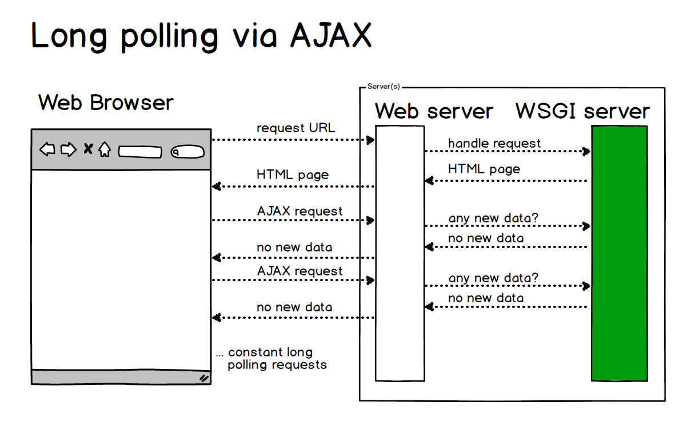

## WebSocket

### Why use WebSockets

> **WebSocket** is a protocol providing `full-duplex` communication channels over a single TCP connection.

### Long polling via AJAX




### Web Console 中实现 WebSocket

```
var webSocket = new WebSocket("ws://echo.websocket.org/?encoding=text");
webSocket.onmessage = function(data) { console.log(data); }
webSocket.send("d")
```

#### Implementing WebSockets

> A multi-threaded or multi-process based server cannot scale appropriately for WebSockets because it is designed to open a connection, handle a request as quickly as possible and then close the connection. An asynchronous server such as Tornado or Green Unicorn monkey patched with gevent is necessary for any practical WebSockets server-side implementation.

#### 服务端实现

> 简单地说，我们有一个非常快速的接线员（Nginx），他负责把问题转交给相应的客服（Handler）。
本身接线员基本上速度是足够的，但是每次都卡在客服（Handler）了，老有客服处理速度太慢。，导致客服不够。
Websocket就解决了这样一个难题，建立后，可以直接跟接线员建立持久连接，有信息的时候客服想办法通知接线员，然后接线员在统一转交给客户。

