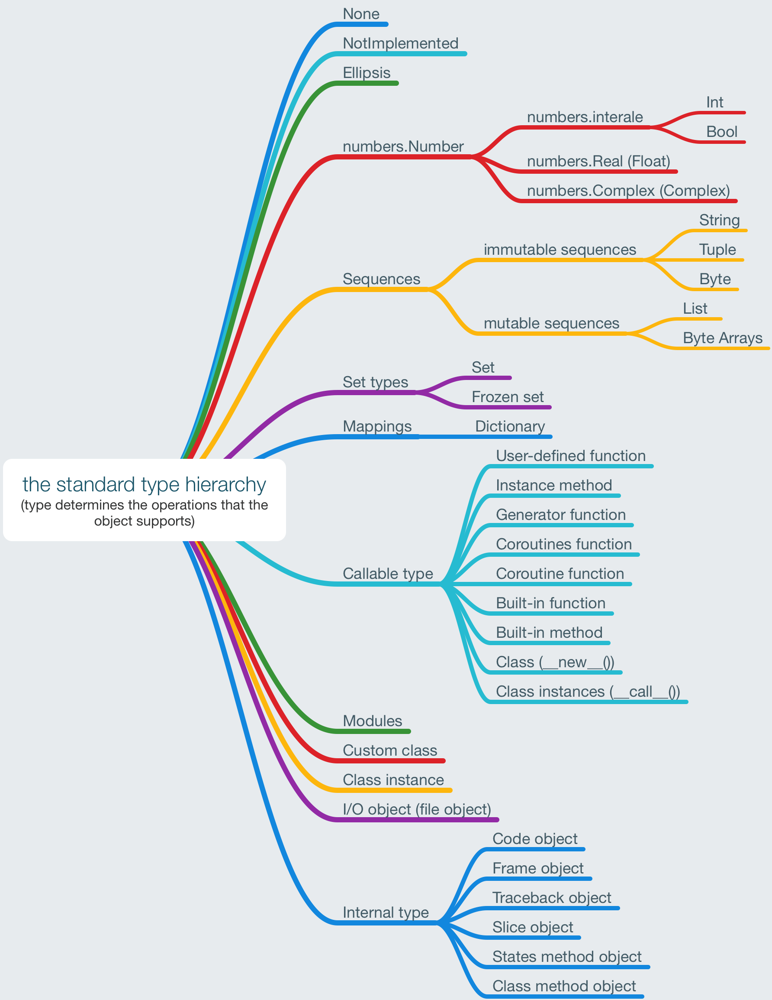

## python object note

#### [objects, values and types](https://docs.python.org/3/reference/datamodel.html#objects-values-and-types)

Objects are Python's abstraction for data. All data in a Python program is represented by objects or by relations between objects(?).

Every objects has:

- an **identity**: never change and the `id()` function returns an integer representing its identity
- a **type**: unchangeable determines the operations that the object supports

| identity                                 | type                                     | value                                    |
| ---------------------------------------- | ---------------------------------------- | ---------------------------------------- |
| unchangeable                             | unchangeable                             | immutable: unchangeable, mutable: changeable |
| id(obj)                                  | type(obj)                                |                                          |
| present the object's address in memory for CPython | determines the operations that the object supports |                                          |


##### aside: hash value and identity

```python
>>> a = 1
>>> b = 1
>>> a is b
True
>>> id(a), id(b)
(4388812848, 4388812848)
>>> a.__hash__()
1

>>> d = {1: 2}
>>> e = {1: 2}
>>> id(d), id(e)
(4418951048, 4419445384)
>>> hash(d)
unhashable type: 'dict'

>>> class C:
    	pass
>>> c = C()
>>> id(c), hash(c)
(4419646688, 276227918)
```

##### aside: the standard type

(every thing in Python is an object, eash object has a type)




